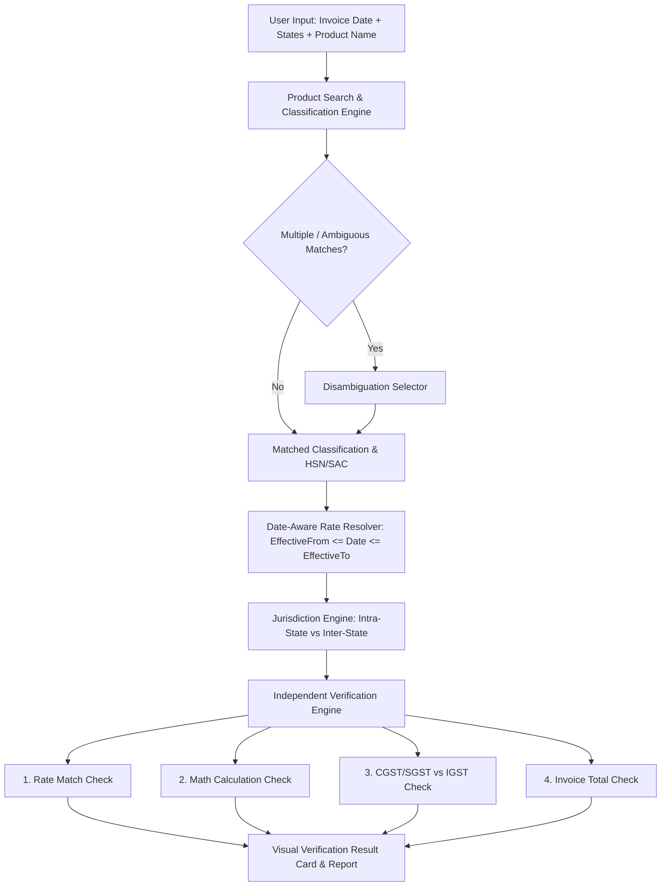

# GST Bill Verifier + GST Calculator — Implementation Task Breakdown (`task.md`)

Based on: [tax1 prd.md](file:///c:/Users/DAVID/Desktop/AI%20Pro%20Learning/tax1/tax1%20prd.md)  
Version: 1.0  
Platform: Web Application (Responsive, Vanilla HTML5 / CSS3 / JavaScript)

---

## 📋 Project Summary & Architectural Roadmap

The application delivers a **Date-Aware, Classification-Aware, and Calculation-Aware** GST bill verification engine and GST calculator for Indian invoices. The user does not need to know HSN/SAC codes.

---

## Phase 1: Project Setup & Core Design System

- [x] **1.1 Project Structure Setup**
  - [x] Initialize project directory structure:
    - `index.html` (Single page application container with tab/view switching)
    - `css/` (`style.css`, `components.css`, `theme.css`)
    - `js/`
      - `data/` (`gstData.js`, `statesData.js`)
      - `services/` (`searchService.js`, `taxRuleService.js`, `verifierService.js`, `calculatorService.js`)
      - `ui/` (`uiController.js`, `formatters.js`, `components.js`)
      - `app.js` (Entry point)
  - [x] Configure standard metadata, responsive viewport, SEO tags, and Google Fonts (`Inter` / `Outfit`).

- [x] **1.2 Design System & Aesthetics (CSS)**
  - [x] Establish CSS Variables / Design Tokens:
    - Primary Indian rupee palette, sleek dark/light modern themes, glassmorphism cards.
    - Status colors: Match (`#10B981` / Emerald), Warning/Mismatch (`#F59E0B` / Amber), Error (`#EF4444` / Crimson), Info (`#3B82F6` / Blue).
  - [x] Build reusable UI component styles:
    - Form inputs, floating labels, custom dropdowns, step indicators.
    - Item cards with "+ Add Item" animation and remove actions.
    - Result status badges, comparison tables, breakdown cards.
    - Modal dialogs for classification disambiguation.
    - Currency format helpers with Indian numbering system (e.g., `₹1,00,000.00`).

---

## Phase 2: Reference Data Models & Datasets

- [x] **2.1 Indian States & Union Territories Master Data (`statesData.js`)**
  - [x] List all 28 states and 8 union territories with state codes (e.g., Maharashtra - 27, Delhi - 07, Karnataka - 29, etc.).
  - [x] Helper method to determine transaction type:
    - `isInterState(sellerStateCode, buyerStateCode)` -> `true` (IGST) or `false` (CGST + SGST/UTGST).

- [x] **2.2 GST Reference Database (`gstData.js`)**
  - [x] Construct JSON schema with historical records support:
    - `hsnSac`: Code string
    - `type`: `"goods"` | `"services"`
    - `description`: Official description
    - `keywords`: Array of search keywords
    - `synonyms`: Array of colloquial Indian names & aliases (e.g., `["badam", "almonds", "dry fruits"]`, `["mobile", "cell phone", "smartphone"]`)
    - `rates`: Array of historical rate objects:
      - `effectiveFrom`: `YYYY-MM-DD`
      - `effectiveTo`: `YYYY-MM-DD` | `null`
      - `gstRate`: Number (e.g., `18`)
      - `cgst`: Number (e.g., `9`)
      - `sgst`: Number (e.g., `9`)
      - `igst`: Number (e.g., `18`)
      - `conditions`: String / description of conditional rules
    - `confidence`: `"high"` | `"medium"`
  - [x] Populate curated seed data for common categories:
    - IT & Electronics (Laptops, Mobile phones, Computer peripherals, Printers)
    - Food & Groceries (Almonds/Badam, Edible oils, Packaged foods, Grains)
    - Apparel & Textiles (Saree, Readymade garments, Footwear < ₹1000 and > ₹1000)
    - Furniture & Home (Chairs, Tables, Wooden furniture)
    - Services (Software services, Hotel accommodation, Restaurant dining, SAC 9996 disambiguated entries)
  - [x] Ensure the dataset is isolated and modular so rates can be updated without touching application code.

---

## Phase 3: Intelligent Product Search & Classification Engine

- [x] **3.1 Search & Match Algorithm (`searchService.js`)**
  - [x] Implement multi-field fuzzy & keyword search matching:
    - Exact name matching
    - Synonyms & Indian aliases matching (e.g., Badam -> Almonds)
    - Keyword indexing
    - HSN/SAC code prefix and exact matching
    - Common spelling variation tolerance
  - [x] Output match score and classification candidates list.

- [x] **3.2 Classification & Disambiguation Handler**
  - [x] **Single strong match**: Mark as `Likely Match` (`confidence: "high"`).
  - [x] **Multiple matches**: Trigger candidate selection modal/UI ("We found multiple possible classifications. Please select the one that best matches your product/service").
  - [x] **Broad or Insufficient description**: (e.g. broad SAC 9996 or generic terms like "Service" without details) -> Return `Unable to Confirm` prompt requiring more info.

- [x] **3.3 Date-Aware Rate Resolver**
  - [x] Implement `getApplicableRate(hsnSacRecord, invoiceDate)`:
    - Match record where `record.effectiveFrom <= invoiceDate <= (record.effectiveTo || '9999-12-31')`.
    - Handle out-of-range dates gracefully.

---

## Phase 4: Independent Verification Engine

- [x] **4.1 Separate Rate Verification (`verifierService.js`)**
  - [x] Compare `Invoice GST Rate` vs. `Applicable GST Rate` for matched classification and date.
  - [x] Result states:
    - ✅ **Matches**: Invoice rate equals applicable rate.
    - ⚠️ **Possible Mismatch**: Invoice rate differs (with note explaining potential conditional exemptions without making definitive legal accusation).
    - ℹ️ **Unable to Confirm**: When classification confidence is low.

- [x] **4.2 Independent Math & Calculation Verification**
  - [x] Compute expected GST: $\text{Expected GST} = \text{Taxable Amount} \times \left(\frac{\text{Applicable Rate}}{100}\right)$ (or computed against entered rate to detect math errors vs rate errors).
  - [x] Compare `Expected GST` vs. `Invoice GST Amount`.
  - [x] Detect & report specific anomaly:
    - *Case A*: Correct rate used, but arithmetic GST calculation is incorrect.
    - *Case B*: Correct arithmetic calculation, but wrong GST rate applied.
    - *Case C*: Both rate and math calculation are incorrect.

- [x] **4.3 Tax Jurisdiction & Component Check (CGST/SGST vs IGST)**
  - [x] For Intra-State (`Seller State == Buyer State`):
    - Verify Expected CGST = 50% of GST, Expected SGST/UTGST = 50% of GST.
    - Flag if invoice erroneously applied IGST.
  - [x] For Inter-State (`Seller State != Buyer State`):
    - Verify Expected IGST = 100% of GST.
    - Flag if invoice erroneously split into CGST + SGST.

- [x] **4.4 Invoice Total & Tolerance Check**
  - [x] Compute expected total: $\text{Taxable Amount} + \text{GST Amount} + \text{Cess (if any)}$.
  - [x] Compare against entered `Invoice Total` with configurable rounding tolerance (e.g. $\pm ₹1.00$).
  - [x] Show clear difference amounts where discrepancies exist.

- [x] **4.5 Multi-Item Invoice Aggregation**
  - [x] Support adding multiple line items per invoice.
  - [x] Verify each item independently.
  - [x] Aggregate overall invoice taxable sum, total GST sum, and verify overall invoice grand total.

---

## Phase 5: Secondary Feature — GST Calculator

- [x] **5.1 Calculation Modes (`calculatorService.js`)**
  - [x] **Mode A: Add GST (Exclusive -> Inclusive)**
    - $\text{GST Amount} = \text{Amount} \times \left(\frac{\text{Rate}}{100}\right)$
    - $\text{Total} = \text{Amount} + \text{GST Amount}$
    - Break down CGST (50%) & SGST (50%) or IGST (100%).
  - [x] **Mode B: Remove GST (Inclusive -> Base Amount)**
    - $\text{Base Amount} = \frac{\text{Inclusive Amount}}{1 + (\text{Rate} / 100)}$
    - $\text{GST Amount} = \text{Inclusive Amount} - \text{Base Amount}$
- [x] **5.2 Quick Rate Selector & Custom Rate**
  - [x] Quick preset chips: `0%`, `5%`, `12%`, `18%`, `28%`.
  - [x] Custom rate input box.
  - [x] Real-time calculation on input change with Indian currency formatting.

---

## Phase 6: User Interface & User Experience Implementation

- [x] **6.1 Home & Navigation View**
  - [x] Hero Header with clear messaging: "Check Your GST Invoice" and concise subtitle.
  - [x] Primary CTA: **Check My Invoice** (prominent main action).
  - [x] Secondary CTA: **GST Calculator**.
  - [x] Navigation header with About, Calculator toggle, and Disclaimer link.

- [x] **6.2 Invoice Verification Form Flow**
  - [x] **Step 1: Invoice Date Picker**
    - Date picker input with notice: *"GST rate is checked based on the invoice date entered."*
  - [x] **Step 2 & 3: Seller & Buyer State Dropdowns**
    - Searchable select boxes populated with all 36 Indian States/UTs.
    - Auto-detect indicator badge: `Intra-State (CGST + SGST)` or `Inter-State (IGST)`.
  - [x] **Step 4: Invoice Items Section**
    - Product / Service input with live autocomplete suggestions.
    - Optional HSN/SAC field.
    - Quantity (optional), Taxable Amount (required).
    - Invoice GST Rate % (required), Invoice GST Amount (required).
    - Dynamic **"+ Add Another Item"** button with smooth insert/remove transitions.
  - [x] **Step 5: Overall Invoice Total** (optional field for overall validation).
  - [x] **Step 6: "Verify Invoice" Action Button**.

- [x] **6.3 Results Display Component**
  - [x] Overall summary banner (✅ Verified / ⚠️ Discrepancy Found / ℹ️ Classification Unconfirmed).
  - [x] Card-by-card breakdown:
    - 📦 Product Classification Card (Matched HSN, Official description, Confidence level).
    - 📊 GST Rate Check Card (Invoice Rate vs Applicable Rate).
    - 🧮 Calculation Check Card (Expected GST vs Invoice GST, difference highlighted).
    - 🏛️ Tax Component Card (CGST + SGST or IGST compliance).
    - 💵 Invoice Total Card (Expected Total vs Actual Total).
  - [x] Plain-language explanatory notes for any detected mismatch.

- [x] **6.4 Disclaimers & Legal Notices**
  - [x] Prominent informational disclaimer in footer & verification results modal:
    > *Disclaimer: GST Bill Verifier is an informational verification tool. Results are based on the information entered by the user, the selected product/service classifications, and GST reference data maintained by the application. GST treatment may vary depending on product classification, exemptions, conditions, place of supply, and other transaction-specific rules. A verification result does not constitute legal, accounting, or tax advice.*
  - [x] Invoice date applicability note.

---

## Phase 7: Verification, Test Scenarios & Quality Assurance

- [x] **7.1 Verification Engine Test Cases**
  - [x] *Test Case 1: Standard Intra-State Match*
    - Date: `15/08/2026`, Seller: `Maharashtra`, Buyer: `Maharashtra`, Item: `Laptop`, Taxable: `₹50,000`, Invoice Rate: `18%`, GST: `₹9,000` (CGST ₹4,500 + SGST ₹4,500), Total: `₹59,000`.
    - Expected: All ✅ Matches.
  - [x] *Test Case 2: Inter-State IGST Match*
    - Seller: `Karnataka`, Buyer: `Delhi`, Item: `Mobile phone`, Expected: IGST applied.
  - [x] *Test Case 3: Rate Mismatch (Case A)*
    - Invoice claims 12% on Laptop (where 18% is applicable) -> Flag ⚠️ Rate Mismatch.
  - [x] *Test Case 4: Math Mismatch (Case B)*
    - Taxable ₹10,000, Rate 18%, but invoice charges GST ₹2,000 instead of ₹1,800 -> Flag ⚠️ Calculation Difference ₹200.
  - [x] *Test Case 5: Jurisdiction Mismatch*
    - Intra-state transaction incorrectly charging IGST instead of CGST + SGST -> Flag ⚠️ Tax Component Error.
  - [x] *Test Case 6: Historical Date Rate Change*
    - Verify product with historical rate amendment uses rate active on the invoice date.
  - [x] *Test Case 7: Disambiguation / Synonym Matching*
    - User types "Badam" -> Correctly resolves to Almonds classification.
    - User types "Software" -> Offers disambiguation options.
  - [x] *Test Case 8: Multi-Item Invoice Total Verification*
    - Invoice with 3 items totaling ₹15,420 with ±₹1 rounding check.

- [x] **7.2 Browser & Mobile Responsiveness Test**
  - [x] Test on mobile (360px - 480px), tablet, and desktop viewports.
  - [x] Validate keyboard accessibility and high-contrast readability.

---

## Phase 8: Final Polish & Documentation

- [x] **8.1 Walkthrough & Verification Summary**
  - [x] Create walkthrough documentation with screenshot/recordings or test validation logs.
  - [x] Confirm compliance with all PRD MVP requirements and Non-Goals.

---

## Phase 9: GSTIN Verification & State Cross-Check Engine

- [x] **9.1 GSTIN Format & Modulo 36 Checksum Validation (`statesData.js`)**
  - [x] 15-character alphanumeric regex structure check.
  - [x] First 2 digits state resolution against all 36 Indian States/UTs.
  - [x] PAN 4th character Entity Type decoding (`Company`, `Individual`, `Partnership/LLP`, `Trust`, etc.).
  - [x] Official GST Luhn Modulo 36 checksum calculation.
- [x] **9.2 Item-Level & Smart Form Sync**
  - [x] Item-level optional GSTIN field.
- [x] **9.3 Verification Engine Audit & Audit Card (`verifierService.js` & `components.js`)**
  - [x] State cross-check between GSTIN and transaction state.
  - [x] Dedicated **🏛️ GSTIN & Entity Verification Card** in audit report.

---

## Phase 10: Download & Print Verification Report (PDF / A4 Certificate)

- [x] **10.1 Print & Save PDF Action Toolbar (`components.js` & `app.js`)**
  - [x] "🖨️ Print / Save PDF" trigger invoking browser `window.print()`.
  - [x] "📋 Copy Summary" button copying plain-text audit details to clipboard.
  - [x] "📜 View History" button opening saved records drawer.
- [x] **10.2 Official A4 Certificate Print Stylesheet (`style.css` `@media print`)**
  - [x] Hides web navigation, buttons, forms, and hero banners.
  - [x] Displays formal Government of India compliance certificate header with timestamp.
  - [x] Formats line items, financial totals, and GSTIN checks with clean high-contrast A4 pagination (`break-inside: avoid;`).

---

## Phase 11: Invoice History & Saved Verifications (Local Storage)

- [x] **11.1 History Storage Service (`historyService.js`)**
  - [x] Local storage CRUD (`saveInvoice`, `getAllInvoices`, `getInvoiceById`, `deleteInvoice`, `clearAll`).
  - [x] JSON export functionality (`exportToJSON`).
- [x] **11.2 History UI Modal & Form Reload (`index.html`, `components.js`, `app.js`)**
  - [x] Header badge counter showing live saved invoice count.
  - [x] Modal drawer listing all saved invoices with date, verdict, items, and grand totals.
  - [x] 1-click "🔄 Load into Form" restoring all fields and re-verifying.

---

## Phase 12: GST Rate Finder & HSN Explorer Tab

- [x] **12.1 Rate Finder UI & Category/Rate Filters (`index.html` & `app.js`)**
  - [x] 3rd main tab in navigation header.
  - [x] Real-time fuzzy search across descriptions, synonyms, and HSN/SAC codes.
  - [x] Interactive Category Chips (`IT & Electronics`, `Food & Groceries`, `Apparel`, `Automobile`, `Services`).
  - [x] Rate Filter Chips (`0%`, `5%`, `12%`, `18%`, `28%`).
- [x] **12.2 Rich Cards & Historical Amendment Timeline (`components.js`)**
  - [x] Expandable timeline showing pre/post rate change dates and conditions.
  - [x] "🧮 Calculate" quick action jumping to calculator tab.
  - [x] "➕ Verify Item" quick action inserting line item into verifier.

---

## Phase 13: Invoice Image / PDF Upload & Smart Auto-Fill

- [x] **13.1 Smart Invoice Document & Text Parser (`ocrService.js`)**
  - [x] Regex pattern recognition for dates (`DD/MM/YYYY`, `YYYY-MM-DD`, textual dates).
  - [x] 15-char GSTIN detection and state mapping.
  - [x] Line item detection (names, taxable values, rates, GST amounts).
  - [x] Grand total and net payable extraction.
- [x] **13.2 Dropzone & Clipboard Text Modal (`index.html` & `app.js`)**
  - [x] Drag-and-drop file upload zone supporting PDF, TXT, CSV, and image files.
  - [x] "📋 Paste Text" modal with 1-click auto-fill.
  - [x] Automatic form population and feedback alerts.

